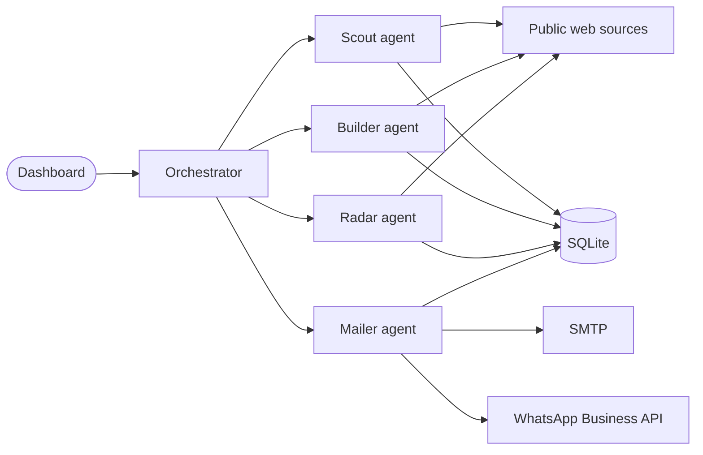
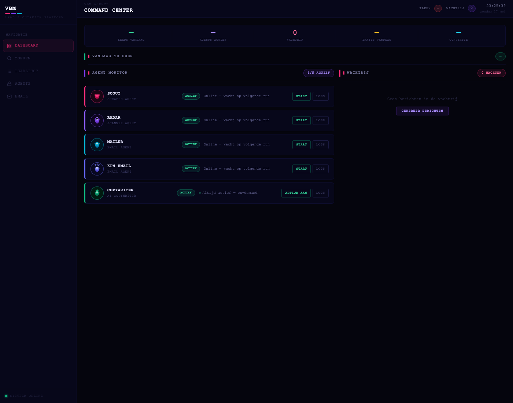

# VBM Leads Tool

> Public showcase repo. Source code lives in a private repo to protect client data and outreach methodology. This page is the technical deep dive.

Local lead intelligence platform built for [VBM Agency](https://vbmagency.nl). Replaces cold lead lists with a system that finds, qualifies, and reaches out to the right local businesses on autopilot.

Runs on `localhost:5001` as a Flask app with a dashboard that controls the full pipeline.

## Why this exists

Manual prospecting at an agency is hours per day of work that no one enjoys. Off the shelf lead tools give you a list, but not a pipeline. I wanted four small agents that together do the boring part end to end, so a human only steps in when a lead replies.

## Architecture



Every agent reads and writes to the same SQLite database. The dashboard is the only human entry point. Agents run on demand or on a schedule.

## The four agents

**Scout** finds candidate businesses given a city, sector, and size profile. Output is raw candidates with source URLs.

**Builder** takes raw candidates and enriches them into full profiles: contact data, tech stack signals, recent activity, fit score.

**Radar** watches known leads for trigger events (new hires, website changes, funding, reviews) and surfaces them in the dashboard so outreach can be timed.

**Mailer** drafts personalized outreach for a given lead, picks the channel (email or WhatsApp), and queues the message for human approval before sending.

Each agent is a small Python module wrapping a Claude prompt and a set of tools (HTTP fetch, DB read/write, search). The orchestrator decides which agents run on which leads.

## Stack
- Python 3, Flask
- SQLite
- Anthropic API (Claude) for agent reasoning
- WhatsApp Business API for outreach
- SMTP for email

## Walkthrough

A Scout run finding new candidate businesses:


The Mailer queueing a personalized outreach draft for approval:


The dashboard overview:



_Replace these paths with your own GIFs and screenshots in `demo/` and `screenshots/`._

## Code excerpts

The Scout agent's system prompt (sanitized):

```python
SCOUT_PROMPT = """
You are a lead research agent. Given a city, a sector, and a size profile,
return up to 20 candidate businesses with source URLs.

Output format: JSON array of {name, url, source, confidence}.

Hard rules:
- Never invent URLs. Skip a candidate if you cannot find a source.
- Skip national chains. We are looking for independent local businesses.
- Confidence is "high" only if you have two independent sources.
"""
```

The orchestrator deciding which agent runs next on a given lead:

```python
def next_action(lead: Lead) -> Agent | None:
    if not lead.enriched:
        return Builder
    if lead.has_recent_signal and not lead.outreach_sent:
        return Mailer
    if lead.age_days > 30:
        return Radar
    return None
```

_Replace with your own sanitized excerpts. Keep the interesting bits: an agent prompt, the orchestration logic, the schema._

## Technical decisions worth calling out

**Why SQLite instead of Postgres.** Single user tool on a local machine. SQLite is one file, no daemon, zero config. The whole database is backup-able by copying one file.

**Why four agents instead of one big one.** Each agent has a narrow job, a short prompt, and predictable output. Easier to test, easier to swap models per agent, cheaper to run.

**Human in the loop on outreach.** Mailer drafts and queues. A human approves before anything sends. Agency reputation is not worth the speedup.

## Status
Private source. Internal tool for VBM Agency. This showcase exists so the work is inspectable without exposing client data or active outreach templates.
